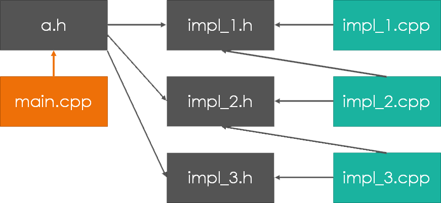
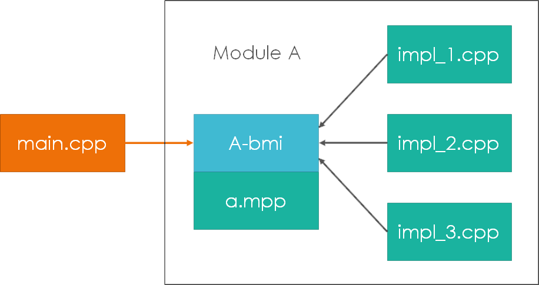

# About C++ Modules
 
## 1. 为什么我们需要C++ Modules？

实际上，关于C++ Modules的讨论由来已久。  
 
多年以来，C++的各个独立模块/编译单元之间通讯的手段，一直沿用C语言的头文件机制。这套机制过于简陋，加之C++中模板和`inline`的大量使用，`#include`已经显得有些不堪重负了。  
 
头文件的问题主要有如下几点：  
 
 * 脆弱的文本展开
 * 内部细节的意外导出
 * 大量的重复处理（N x M）导致了低下的编译效率
 * 无法保证编译单元的一致性（ODR）
 * 对开发工具很不友好
 
一个经典的例子是`#include <Windows.h>`引发的莫名其妙的编译错误：  

```c++
#include <iostream>
#include <limits>

#include <Windows.h>

int main() {
    std::cout << std::numeric_limits<int>::max() << std::endl;
    /*
        warning C4003: not enough actual parameters for macro 'max'
        error C2589: '(' : illegal token on right side of '::'
        error C2143: syntax error : missing ')' before '::'
        error C2059: syntax error : ')'
    */
    return 0;
}
```
 
关于使用头文件的各种问题，可以参考 [A Module System for C++](http://www.open-std.org/jtc1/sc22/wg21/docs/papers/2016/p0142r0.pdf) 这篇paper，以及clang的[Modules介绍](https://clang.llvm.org/docs/Modules.html)。

## 2. C++ Modules怎么用？

目前最新的提案是 [Merging Modules R2](http://www.open-std.org/jtc1/sc22/wg21/docs/papers/2018/p1103r2.pdf)。  
 
### 2.1 Say Hello to Module

我们首先来看看一个基于模块的 [Hello World](codes/msvc/01.hello_world/main.cpp)

```c++
import std.core;

int main() {
    std::cout << "hello world!" << std::endl;
    return 0;
}
```

这里的第一行`import std.core;`，指示编译器在编译当前单元的时候，寻找并导入模块`std.core`。  
 
与头文件版本相比，在代码上的改动仅仅是把 `#include <iostream>` 换成了对应的 `import`；但对于编译器来说，这里的变化是巨大的。在使用头文件的时候，编译器通过预处理，会将这个简单的hello world展开成一个上万行代码的巨大编译单元，之后再按部就班的进行后续的解析。这也是为什么一个小小的hello world，编译的时间仍然是秒级的原因。
 
而使用模块的版本，在导入模块 `std.core` 的时候，编译器寻找到的则是模块 `std.core` 对应的二进制模块接口（BMI，Binary Module Interface）。导入模块的代价是轻微的，模块中的代码不会被重复编译（因为它们在生成模块BMI时就已经编译过了），因此编译器仅需要处理我们实际看到的那寥寥数行代码。

所以说，单纯拿使用 `import` 和使用 `#include` 的代码比较编译速度是不太公平的，编译器面对两者时处理的代码量根本就不是一个量级。我们得把模块本身的编译时间也算进去。

### 2.2 自定义一个Module

首先，我们需要一个模块接口单元（module interface unit）：

```c++
export module hello;

import std.core;
using namespace std;

export namespace hello {
    void say(const char* str) {
        cout << str << endl;
    }
}
```

在一个编译单元的最上方使用 `export module` 加上模块名称，我们就定义了一个模块接口单元。在模块接口单元中，并不是所有的实体都是导出的。想要导出实体，我们需要显式标明 `export`。  
 
因此，上方的模块 `hello` 中，仅有 `namespace hello` 里的 `say` 函数是导出的， `import std.core` 和 `using namespace std` 并不会被导出，它们的范围仅限于当前模块。  
 
之后，这个模块的使用就和标准库模块一样简单：  

```c++
import hello;

int main() {
    hello::say("hello module!");
//  std::cout << "hello!" << std::endl; /* error */
    return 0;
}
```

那么想要在 `import std.core` 的同时导出它，自然就是在前面加上 `export` 了：

```c++
export module hello;

export import std.core;
using namespace std;

export namespace hello {
    void say(const char* str) {
        cout << str << endl;
    }
}
```

关于 `export import` 这个含义晦涩的写法，reddit上还有一些有意思的讨论：[https://www.reddit.com/r/cpp/comments/69i38l/using_c_modules_in_visual_studio_2017/](https://www.reddit.com/r/cpp/comments/69i38l/using_c_modules_in_visual_studio_2017/)。

### 2.3 Module Linkage

模块接口单元（module interface unit）里不仅可以定义导出的实体，同样也可以定义非导出的实体。不同于之前C++的内部链接（internal linkage）和外部链接（external linkage），这些非导出的实体具有模块链接（module linkage）。  
 
模块链接的意义在于这部分实体对于当前模块的所有编译单元来说都是可见的。这个特征可以很方便的在一个模块内的多个编译单元之间共享实体。  
 
比如说，我们的模块hello可以拥有两个不同的编译单元，其中模块接口单元定义如下：

```c++
export module hello;

/* module linkage */
namespace hello {
    void say_hi();
}

/* external linkage */
export namespace hello {
    void say_hello();
    void say_xz();
}
```

这里非导出的 `hello::say_hi` 即为具有模块链接的模块内部实体。通过模块接口单元给出声明，接下来我们需要通过模块实现单元（module implementation unit）提供具体的定义：

```c++
module hello;

import std.core;
using namespace std;

namespace hello {
    void say_hi() {
        cout << "hello hi!" << endl;
    }

    void say_hello() {
        cout << "hello world!" << endl;
    }

    void say_xz() {
        cout << "hello xz!" << endl;
    }
}
```

模块实现单元和模块接口单元不同之处仅在于上方 `module hello` 的前面没有 `export`。将模块实现分割为一个模块接口单元，和多个模块实现单元，这种写法和我们使用头文件实现接口分离时很像，但它们之间有着本质的区别。  
 
使用头文件时，对于独立的某个功能模块，我们的代码组织结构可能会像下面这样：  
 
  
 
在这里，对于每个编译单元（cpp）来说，头文件提供了声明，以及部分公共代码；编译单元之间不存在依赖关系，它们将同时依赖某个或多个头文件。头文件的修改，意味着所有依赖此头文件的编译单元都需要重新编译。  
 
而使用模块之后，将变为这样：  
 
  
 
此时，模块A中的头文件消失了，取而代之的是模块接口单元 `a.mpp`，它本身也是一个编译单元。编译对头文件的依赖将转化为对模块接口单元的依赖，模块A的接口单元会先行编译，之后其它编译单元才会开始各自的编译。  
 
接口单元对模块A内部的编译单元，和模块A外部的使用者提供了不同的内容，对于同属于模块A的编译单元 `impl_*.cpp` 来说，它们能看到A中声明/定义的所有实体（除了内部链接的实体），不论是导出的，还是非导出的。但对于外部的使用者单元来说，它们仅能看到A中标记为导出的实体，其它内容对它们来说则是不可见的（BMI中不会包含非导出的内容）。  
 
因此，对一个模块来说，修改其非导出的模块链接部分，不会让这个模块的BMI发生变化，也不会引发外部依赖此模块的其它模块或编译单元的重新编译。

### 2.4 Module Partitions

通过非导出的模块链接（module linkage）实体，我们可以在一个模块内部的多个实现单元（module implementation unit）之间共享内容。但这些需要被共享的部分必须统统定义在模块接口单元（module interface unit）中，否则其它实现单元还是只能依赖头文件才能访问它们。  
 
Google在 [Another take on Modules](http://www.open-std.org/jtc1/sc22/wg21/docs/papers/2018/p0947r1.html) 中提出了模块分区（module partition）的概念，并在 [Merging Modules](http://www.open-std.org/jtc1/sc22/wg21/docs/papers/2018/p1103r2.pdf) 中被采用。